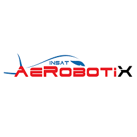

# 🚀 Aerobotix INSAT – Computer Vision App

  

Welcome to the official **Aerobotix INSAT Computer Vision App** 🎉  
This project showcases our work in **computer vision** through:

- 🖥️ A modern **ElectronJS + TailwindCSS application** presenting our projects.  
- 🎮 A fun **Fruit Ninja with Computer Vision game** built with Python + OpenCV.  

This app will be presented during the **Journée d’Intégration des Clubs INSAT** to demonstrate our club’s expertise in robotics and vision systems.

---

## 📂 Repository Structure

\`\`\`
Aerobotix_App/
│
├── assets/                     # Logos & screenshots
│   ├── aerobotixlogo.png
│   ├── fruitgame.png
│   └── app.png
│
├── src/                        # HTML presentations
│   ├── welcome.html
│   ├── presentation1.html
│   ├── presentation2.html
│   └── fruit-ninja-with-computer-vision-main/
│       ├── main.py             # Fruit Ninja CV game entry
│       └── ... (Python code)
│
├── requirements.py             # Installs Python dependencies
├── main.js                     # Electron main process
└── package.json
\`\`\`

---

## 🛠️ Installation & Setup

### 0️⃣ Clone the Repository
\`\`\`bash
git clone https://github.com/<your-username>/Aerobotix_App.git
cd Aerobotix_App
\`\`\`

### 1️⃣ Python Side (Fruit Ninja Game)
Make sure Python (3.10+ recommended) is installed.  
Run once to install and verify dependencies:

\`\`\`bash
python requirements.py
\`\`\`

➡️ After this, you can already run the Fruit Ninja game directly:
\`\`\`bash
cd src/fruit-ninja-with-computer-vision-main
python main.py
\`\`\`

### 2️⃣ Node.js Side (Electron App)
Install [Node.js](https://nodejs.org/) (LTS recommended). Then:

\`\`\`bash
npm install
\`\`\`

Start the app:
\`\`\`bash
npm start
\`\`\`

### 3️⃣ Build as Executable (.exe)
\`\`\`bash
npm run dist
\`\`\`

---

## ⚠️ Manual Path Adjustments (Important!)

If you cloned the repo, update **absolute paths** in these files before running:

- **\`src/presentation1.html\`**
  \`\`\`html
  /Desktop/Aerobotix_App/assets/robot.png" ... />
  \`\`\`

- **\`src/presentation2.html\`**
  \`\`\`html
  /Desktop/Aerobotix_App/assets/img2.jpg" ... />
  /Desktop/Aerobotix_App/assets/img1.jpg" ... />
  \`\`\`

- **\`main.js\`**  
  Update paths for:
  - \`icon\`  
  - \`preload.js\`  
  - \`welcome.html\`  
  - \`main.py\` (Fruit Ninja game)  
  - \`pythonPath\`  

👉 Replace `C:/Users/LENOVO/Desktop/...` with your own absolute repo path.

---

## 📸 Screenshots

  
  

---

## 👨‍💻 About Aerobotix INSAT

We are **Aerobotix Club – INSAT**, passionate about **robotics, AI, and computer vision**.  
This project merges **fun + learning**, showing the real power of vision-based systems in interactive demos.  

  <b>🔗 Together we build the future of robotics!</b>

